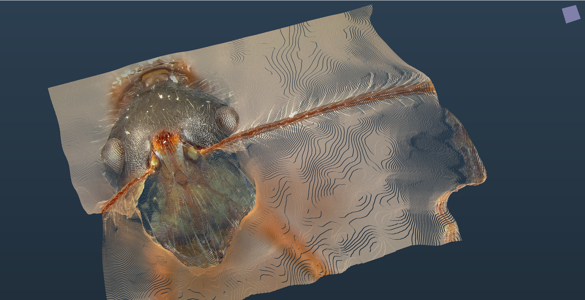

  # 3DFramework

  Windows app that mix [openFrameworks](https://github.com/openframeworks/openFrameworks), [ImGui](https://github.com/ocornut/imgui), [OpenCascade](https://github.com/Open-Cascade-SAS/OCCT) & [VTK](https://github.com/Kitware/VTK).

## Features
<table width="700">
  <tr>
    <td width="100">Textured depthmap</td>
    <td rowspan=1>
      
    </td>
  </tr>
  <tr>
    <td>Point cloud</td>
    <td rowspan=1>
      
    </td>
  </tr>
  <tr>
    <td>CAD</td>
    <td rowspan=1>
      
    </td>
  </tr>
  <tr>
    <td>Volume with transfer function</td>
    <td rowspan=1>
      
    </td>
    </tr>
</table>

## Dependencies

### [openFrameworks](https://github.com/openframeworks/openFrameworks)
### [ImGui](https://github.com/ocornut/imgui)
with the following extensions: 
#### [ofXImGui](https://github.com/Daandelange/ofxImGui)
#### [ImGuizmo](https://github.com/CedricGuillemet/ImGuizmo)
#### [imgui-transfer-function](https://github.com/kogiokka/imgui-transfer-function)
### [OpenCascade](https://github.com/Open-Cascade-SAS/OCCT)
### [VTK](https://github.com/Kitware/VTK)

