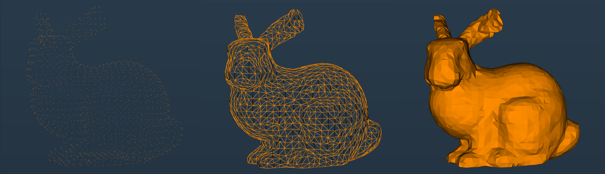
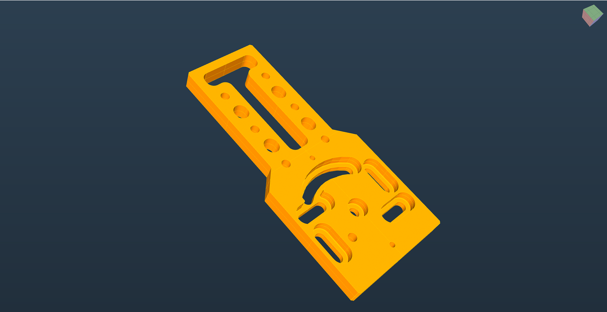
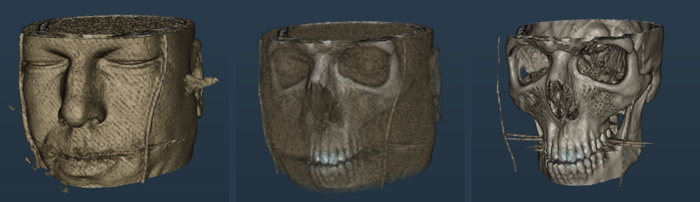

  # 3DFramework

  Windows app that mix [OpenFrameworks](https://github.com/openframeworks/openFrameworks), [ImGui](https://github.com/ocornut/imgui), [OpenCascade](https://github.com/Open-Cascade-SAS/OCCT) & [VTK](https://github.com/Kitware/VTK).

## Features
<table width="700">
  <tr>
    <td width="100">Textured depthmap</td>
    <td>
      
    </td>
  </tr>
  <tr>
    <td>Point cloud</td>
    <td>
      
    </td>
  </tr>
  <tr>
    <td>CAD</td>
    <td>
      
    </td>
  </tr>
  <tr>
    <td>Volume with transfer function</td>
    <td>
      
    </td>
    </tr>
</table>

<h2>Dependencies</h2>
<table>
  <tr>
    <td><b>Dependency</b></td>
    <td><b>Repository Link</b></td>
  </tr>
  <tr>
    <td>OpenFrameworks</td>
    <td><a href="https://github.com/openframeworks/openFrameworks">GitHub Repository</a></td>
  </tr>
  <tr>
    <td>ImGui</td>
    <td><a href="https://github.com/ocornut/imgui">GitHub Repository</a></td>
  </tr>
  <tr style="font-size: x-small;">
    <td>&nbsp;&nbsp;&nbsp;&nbsp;ofxImGui</td>
    <td><a href="https://github.com/Daandelange/ofxImGui">GitHub Repository</a></td>
  </tr>
  <tr style="font-size: x-small;">
    <td>&nbsp;&nbsp;&nbsp;&nbsp;ImGuizmo</td>
    <td><a href="https://github.com/CedricGuillemet/ImGuizmo">GitHub Repository</a></td>
  </tr>
  <tr style="font-size: x-small;">
    <td>&nbsp;&nbsp;&nbsp;&nbsp;imgui-transfer-function</td>
    <td><a href="https://github.com/kogiokka/imgui-transfer-function">GitHub Repository</a></td>
  </tr>
  <tr>
    <td>OpenCascade</td>
    <td><a href="https://github.com/Open-Cascade-SAS/OCCT">GitHub Repository</a></td>
  </tr>
  <tr>
    <td>VTK</td>
    <td><a href="https://github.com/Kitware/VTK">GitHub Repository</a></td>
  </tr>
</table>
